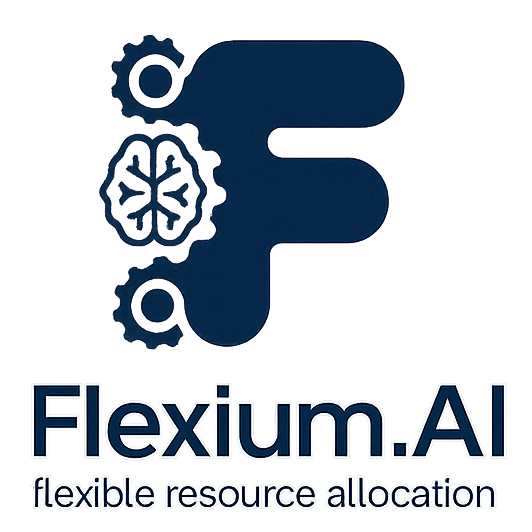
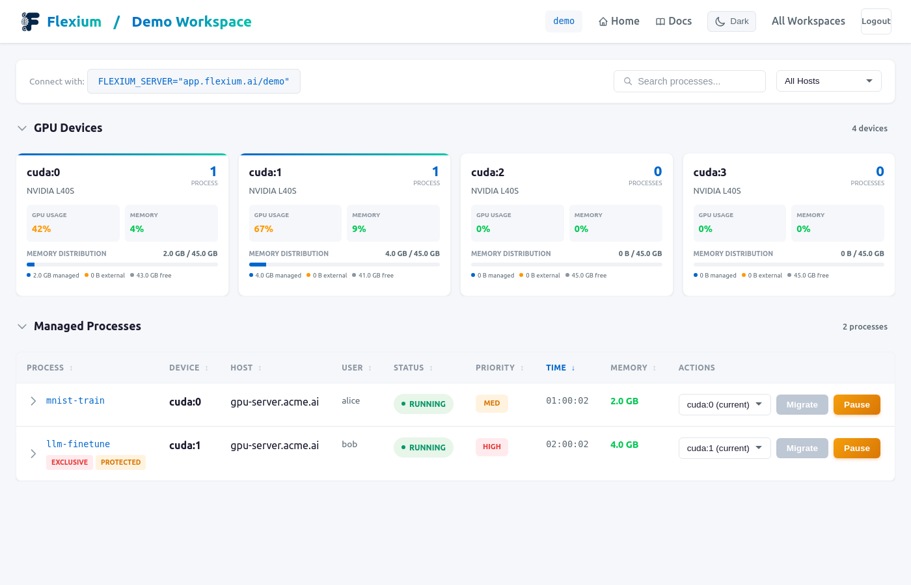
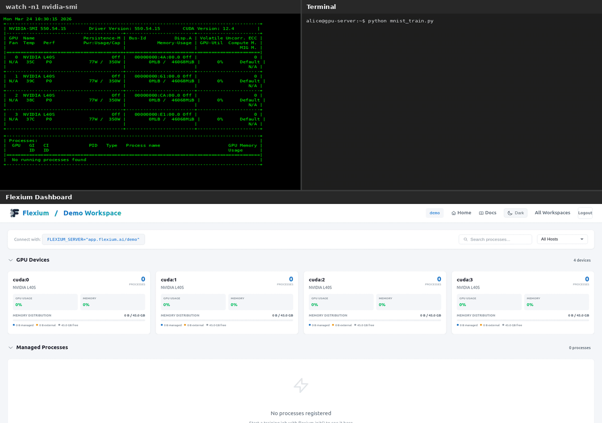

# Flexium.AI

<p align="center">
  
</p>

**Flexible Resource Allocation** - Seamlessly migrate PyTorch training between GPUs with zero interruption. Your model continues from exactly where it left off, and the source GPU is completely freed with zero VRAM residue.

---

## :material-handshake: Become a Design Partner

We're looking for **design partners** to explore advanced capabilities:

- Automatic migration based on resource optimization
- Distributed training support (DDP/FSDP)
- Integration with job schedulers (Slurm/Kubernetes)
- Multi-node GPU orchestration

If you're managing multi-GPU servers and want to shape the future of GPU orchestration, we'd love to hear from you!

**[:material-email: Contact us](mailto:flexium.ai@gmail.com?subject=Design%20Partner%20Inquiry){ .md-button .md-button--primary }**

---

<div class="grid cards" markdown>

-   :material-clock-fast:{ .lg .middle } __Quick Start__

    ---

    Get up and running in 5 minutes with just 2 lines of code.

    [:octicons-arrow-right-24: Getting Started](getting-started.md)

-   :material-cube-outline:{ .lg .middle } __Architecture__

    ---

    Understand how flexium guarantees zero memory residue.

    [:octicons-arrow-right-24: Architecture](ARCHITECTURE.md)

-   :material-api:{ .lg .middle } __API Reference__

    ---

    Complete documentation of all public APIs.

    [:octicons-arrow-right-24: API Reference](api.md)

-   :material-code-tags:{ .lg .middle } __Examples__

    ---

    Working examples from simple to production-ready.

    [:octicons-arrow-right-24: Examples](examples.md)

-   :material-gauge-full:{ .lg .middle } __Dashboard__

    ---

    Monitor jobs and migrate GPUs with one click.

    [:octicons-arrow-right-24: Open Dashboard](https://app.flexium.ai){ target="_blank" }

</div>

---

## What is Flexium?

Flexium is a GPU orchestration system that enables **dynamic device migration** for PyTorch training jobs. It allows training processes to be moved between GPUs **without leaving any memory traces** on the source device.

### Key Features

- **Seamless Migration**: Training continues from the exact point where it left off. No progress lost
- **Zero VRAM Residue**: When you migrate, the source GPU is completely freed. Not 99%, literally 0 bytes used
- **Zero Server Installation**: Just `pip install flexium`. No agents, daemons, or infrastructure needed
- **Minimal Code Changes**: Add 2 lines of code, done. Works with PyTorch Lightning, Hugging Face, timm, and more
- **Cloud Dashboard**: Monitor all jobs in real-time. One-click migration at [app.flexium.ai](https://app.flexium.ai)
- **Graceful Degradation**: Lost connection? Training keeps running. Reconnects automatically when available
- **GPU Error Recovery**: OOM or ECC errors? Auto-recover by migrating to a healthy GPU

### The Problem

Traditional approaches to GPU migration leave memory fragments:

```python
# This doesn't fully free memory!
model = model.to("cuda:1")  # Old GPU still has memory residue
torch.cuda.empty_cache()     # Doesn't guarantee cleanup
```

### The Solution

Flexium uses **driver-level migration** that guarantees complete memory release:

```
┌───────────────────────────────────────┐
│        Training on OLD GPU            │
│                                       │
│  Your PyTorch code runs normally      │
│                                       │
└───────────────────────────────────────┘
                   │
                   │  MIGRATE
                   │  (100% memory freed!)
                   ▼
┌───────────────────────────────────────┐
│        Training on NEW GPU            │
│                                       │
│  Resumes from exact position          │
│  No progress lost                     │
│                                       │
└───────────────────────────────────────┘
```

---

## Quick Example

### Before (Standard PyTorch)

```python
import torch

model = Net().cuda()
optimizer = torch.optim.Adam(model.parameters())

for epoch in range(100):
    for batch in dataloader:
        data = batch.cuda()
        loss = model(data).sum()
        loss.backward()
        optimizer.step()
```

### After (With Flexium)

```python
import flexium
flexium.init()  # That's it!

import torch

model = Net().cuda()
optimizer = torch.optim.Adam(model.parameters())

for epoch in range(100):
    for batch in dataloader:
        data = batch.cuda()
        loss = model(data).sum()
        loss.backward()
        optimizer.step()
```

**That's it!** Your training is now migration-enabled.

??? note "Explicit Scope Control (Advanced)"
    For cases where you need explicit control over when Flexium is active:
    ```python
    import flexium.auto

    with flexium.auto.run():
        model = Net().cuda()
        # Flexium is active only within this block
        for epoch in range(100):
            ...
    ```

---

## Installation

```bash
pip install flexium
```

Or from source:

```bash
git clone https://github.com/flexiumai/flexium.git
cd flexium
pip install -e .
```

See the [Installation Guide](installation.md) for detailed instructions including:

- System requirements and driver compatibility
- PyTorch with CUDA setup
- Environment configuration
- Troubleshooting common issues

### Requirements

- Python 3.8+
- PyTorch 2.0+ with CUDA support
- Linux x86_64
- NVIDIA Driver:
    - **550+** for pause/resume (same GPU)
    - **580+** for GPU migration (different GPU)

**Note:** Flexium requires PyTorch with CUDA support. Install PyTorch following the [official instructions](https://pytorch.org/get-started/locally/) for your system.

---

## How It Works

1. **Sign Up**: Create a free account at [app.flexium.ai](https://app.flexium.ai) and create a workspace

2. **Connect Your Training**: Set your workspace and run
   ```bash
   export FLEXIUM_SERVER="app.flexium.ai/myworkspace"
   python train.py
   ```

3. **Monitor & Migrate**: Via web dashboard at [app.flexium.ai](https://app.flexium.ai)
   - See all running training jobs
   - One-click migration between GPUs
   - Pause and resume training



**Live Migration Demo:**



---

## Architecture Overview

```
┌───────────────────────────────────────────────────────────┐
│                      YOUR GPU MACHINE                     │
│                                                           │
│  ┌─────────────────────────────────────────────────────┐  │
│  │                  Training Process                   │  │
│  │  - Your PyTorch training code                       │  │
│  │  - Initialized with flexium.init()                  │  │
│  └─────────────────────────────────────────────────────┘  │
│                                                           │
│  ┌─────────┐  ┌─────────┐  ┌─────────┐  ┌─────────┐       │
│  │  GPU 0  │  │  GPU 1  │  │  GPU 2  │  │  GPU 3  │       │
│  └─────────┘  └─────────┘  └─────────┘  └─────────┘       │
└───────────────────────────────────────────────────────────┘
                            │
                            │ Communicates with
                            ▼
┌───────────────────────────────────────────────────────────┐
│                 FLEXIUM CLOUD (flexium.ai)                │
│                                                           │
│         Web dashboard for monitoring and control          │
└───────────────────────────────────────────────────────────┘
```

---

## Use Cases

### Dynamic GPU Allocation

Move training jobs between GPUs based on demand via the dashboard:

1. Open your workspace at [app.flexium.ai](https://app.flexium.ai)
2. Find the job you want to move
3. Click "Migrate" and select the target GPU

### Memory Management

Free up a GPU for a larger model:

1. Find the smaller job in the dashboard
2. Migrate it to another GPU
3. Your original GPU now has more free memory

### Fault Tolerance

If a GPU has issues, migrate affected jobs via dashboard - select each job and move to a healthy GPU.

### Development Workflow

Test on GPU 0, then move to production GPU:

1. Start training: `python train.py` (runs on cuda:0)
2. Open dashboard at [app.flexium.ai](https://app.flexium.ai)
3. Click "Migrate" to move to production GPU without stopping

---

## Why Flexium?

<div class="grid cards" markdown>

-   :material-memory:{ .lg .middle } __Zero VRAM Residue__

    ---

    Unlike `model.to(device)`, migration **guarantees** 100% memory is freed. Flexium's architecture ensures complete GPU release.

-   :material-flash:{ .lg .middle } __GPU Error Recovery__

    ---

    GPU errors (OOM, device assert, ECC) can be recovered automatically. Use `recoverable()` to enable auto-migration and retry on errors.

-   :material-shield-check:{ .lg .middle } __Works Offline__

    ---

    If connection to Flexium is lost, your training keeps running. It reconnects automatically when the server is back.

-   :material-chart-line:{ .lg .middle } __Real-Time Dashboard__

    ---

    Monitor all training jobs, GPU utilization, and memory usage. One-click migration between devices.

-   :material-code-tags:{ .lg .middle } __Minimal Code Changes__

    ---

    Just 2 lines of code to enable. No changes to your training logic, model, or dataloader.

-   :material-wrench:{ .lg .middle } __GPU Error Recovery__

    ---

    OOM, ECC errors, device asserts — automatically recover by migrating to a healthy GPU and retrying.

</div>

---

## Documentation

| Document | Description |
|----------|-------------|
| [Getting Started](getting-started.md) | Quick start guide |
| [Installation](installation.md) | Detailed installation guide |
| [Architecture](ARCHITECTURE.md) | How flexium works |
| [API Reference](api.md) | Complete API documentation |
| [Examples](examples.md) | Code examples |
| [Troubleshooting](troubleshooting.md) | Common issues and solutions |

### Feature Documentation

| Feature | Description |
|---------|-------------|
| [Zero-Residue Migration](features/zero-residue-migration.md) | Driver-level migration with zero VRAM residue |
| [GPU Error Recovery](features/gpu-error-recovery.md) | Automatic recovery from OOM, ECC, and other GPU errors |
| [Pause/Resume](features/pause-resume.md) | Pause training to free GPU, resume later |
| [Works Offline](features/graceful-degradation.md) | Training continues even if server connection is lost |
| [Framework Compatibility](features/framework-compatibility.md) | Works with PyTorch Lightning, Hugging Face, timm, and more |

---

## License

MIT License - see [LICENSE](LICENSE) for details.

## Contributing

Contributions welcome! Please see our [GitHub repository](https://github.com/flexiumai/flexium) to report issues or submit pull requests.
